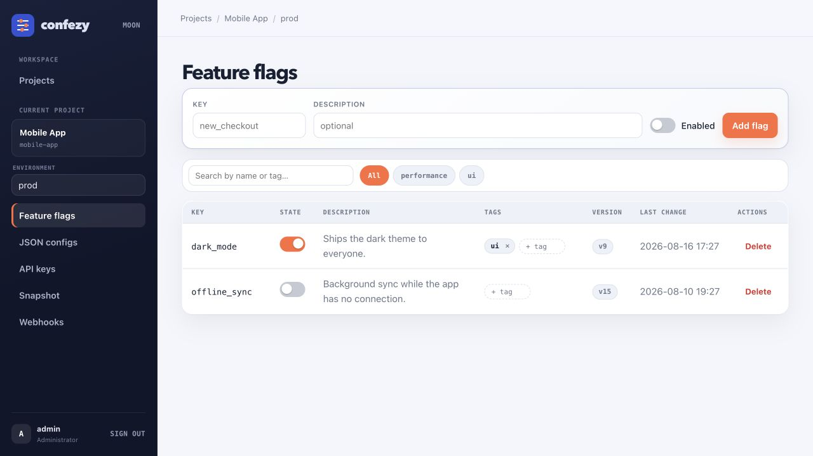
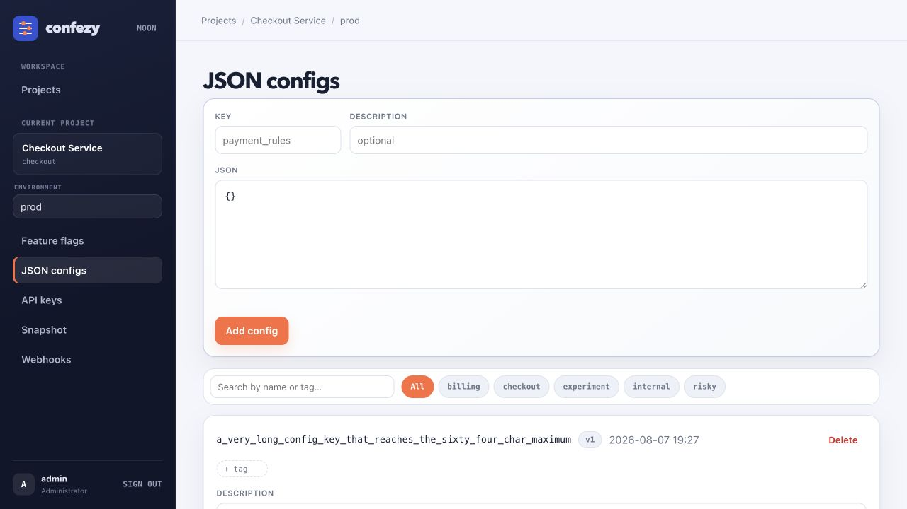
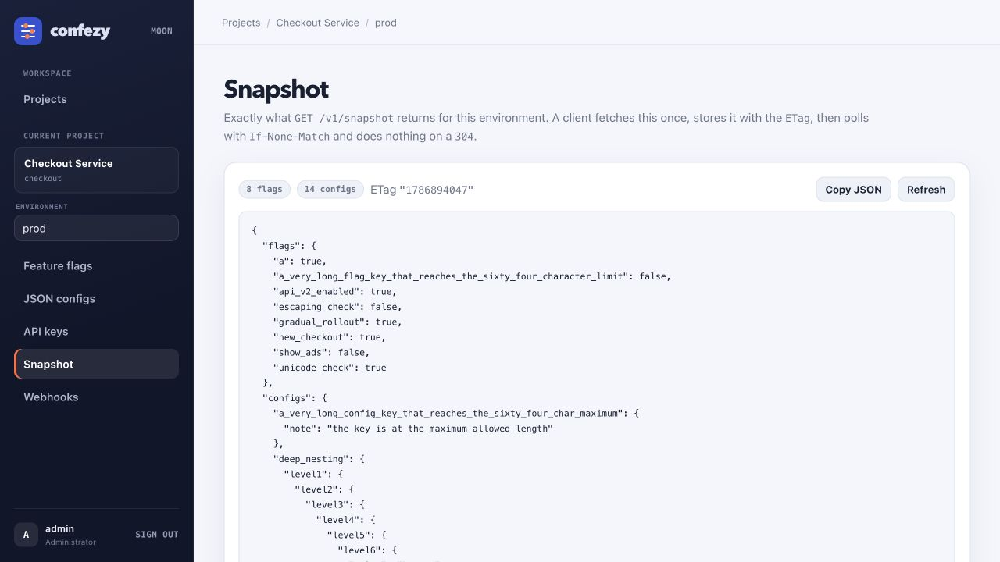

# confezy

Feature flag and JSON config service. A single executable: SQLite (WAL) storage, a JSON API
for clients, and an embedded HTMX admin panel. No CGO, so the binary is static and
cross-compiles cleanly. Nothing is fetched at runtime — HTMX, the CSS and the templates are
all compiled into the binary.

## Interface

<p align="center">
  
</p>

<p align="center"><sub>Environment-scoped feature flags</sub></p>

<p align="center">
  
  
</p>

<p align="center"><sub>JSON config editor · Client snapshot</sub></p>

The panel keeps projects, environments, feature flags, JSON configs, API keys, snapshots and
webhooks in one focused workspace. Flags can be searched, tagged and toggled in place, with their
version and last change visible alongside the current state. Light and dark themes are built in.

## Build

```bash
CGO_ENABLED=0 go build -ldflags="-s -w" -o confezy .

# Cross-compile:
GOOS=linux GOARCH=arm64 CGO_ENABLED=0 go build -ldflags="-s -w" -o confezy .
```

## Run

```bash
# 1) Admin account (the password is read from the terminal, never echoed)
./confezy admin-create -username admin -db ./data.db

# To change it later:
./confezy admin-create -username admin -db ./data.db -reset

# 2) Server
./confezy serve -port 8080 -db ./data.db
```

Panel: <http://localhost:8080/ui/login>

`serve` flags: `-port` (default 8080), `-host` (default all interfaces), `-db` (default
`./data.db`). Migrations run automatically on every start.

### Configuration via environment

A `.env` file in the working directory is loaded at startup (`CONFEZY_ENV_FILE` overrides the
path). Real environment variables always win over the file. Start from the template:

```bash
cp .env.example .env
```

| Variable | Meaning |
|---|---|
| `CONFEZY_ADMIN_USERNAME` | 3–64 characters |
| `CONFEZY_ADMIN_PASSWORD` | at least 8 characters |
| `CONFEZY_ADMIN_PASSWORD_FILE` | read the password from a file; takes precedence over `CONFEZY_ADMIN_PASSWORD` |
| `CONFEZY_SEED_DATA` | insert the demo dataset. Default `1` |
| `CONFEZY_PORT` | host port published by Docker Compose |

Admin bootstrap behaviour:

- If the account does **not** exist it is created (argon2id hashed; the plaintext is never
  stored).
- If it **does** exist its password is left alone — a restart must not undo a password you
  changed with `-reset`, nor resurrect one you rotated.
- Setting only one of the two, or a password that is too short, fails the start with a clear
  message.
- With neither set and no account present, a warning is logged.

If the password lives in an environment variable it is visible through `docker inspect` and
`/proc/<pid>/environ`. Where secret management exists, prefer `CONFEZY_ADMIN_PASSWORD_FILE` —
Docker and Kubernetes secrets are mounted as files.

### Demo data

On its first start against an **empty** database, confezy inserts a demo dataset so the admin
panel has something to show: three projects, six environments, flags and configs covering
every JSON shape and both key-length extremes, plus API keys in every scope including a
revoked one.

It only ever touches a database with no projects in it, so restarts never duplicate rows and
real data is never overwritten. Turn it off for a clean install:

```bash
CONFEZY_SEED_DATA=0 ./confezy serve
```

The seeded API keys are **display-only**: their stored hashes match no real key, so none of
them authenticate anything. Create a working key from the panel.

## Docker

Local, with the port published on your machine:

```bash
cp .env.example .env      # edit the admin password first
docker compose -f docker-compose.yml -f docker-compose.local.yml up -d --build
```

The image is multi-stage: a Go builder and an Alpine runtime running as a non-root user
(uid 10001). `/healthz` backs both the Dockerfile `HEALTHCHECK` and the Compose health check.
`.env` is excluded from the build context, so no secret lands in an image layer.

### Deploying (Dokploy, Coolify, plain Compose)

`docker-compose.yml` on its own is the deployment shape: no host port, configuration through
environment variables. Use it as-is and set the variables in the platform's UI.

**The volume is not optional.** The SQLite database lives at `/data`, and most platforms
*recreate* the container on redeploy rather than restarting it. With nothing mounted there,
Docker hands the new container a fresh anonymous volume: the database is empty, migrations
run, the demo seed runs, and it looks like the service reinstalled itself. `docker restart`
hides this, because it reuses the same container — the loss only shows on the next deploy.

- Deploy type must be **Compose**, so `docker-compose.yml` is actually read. A Dockerfile-only
  deploy ignores it, and with it the volume.
- If the platform manages mounts itself instead, add a persistent volume at `/data`.
- Point the domain at container port **8080** (the service uses `expose`, so the platform's
  proxy reaches it directly; nothing is published on the host).
- Set `CONFEZY_SEED_DATA=0`. Demo data on an empty database makes a wiped volume look like a
  healthy fresh install; without it, an empty panel tells you immediately.

Compose reads a `.env` sitting next to the compose file for `${VAR}` substitution, which is
how a platform's environment settings reach the container.

Every start says which of the two happened, so a lost volume is visible rather than silent:

```
confezy: opened existing database at /data/confezy.db
confezy: no database found at /data/confezy.db — creating a new one. If this is a redeploy
         rather than a first install, the volume holding the database did not survive and
         the previous data is gone.
```

To check that persistence works: create a project, redeploy, and confirm it is still there —
and that the log says *opened existing database*.

Without Compose:

```bash
docker build -t confezy .
docker run -d -p 8080:8080 -v confezy-data:/data \
  -e CONFEZY_ADMIN_USERNAME=admin -e CONFEZY_ADMIN_PASSWORD=change-this-password \
  confezy
```

## Concepts

```
Project
├── Tags                (labels shared by every environment of the project)
└── Environment ("prod" is created automatically with the project)
    ├── Feature Flags   (bool)
    ├── JSON Configs    (any valid JSON)
    └── API Keys        (read / write / admin)
```

Flag and config key format: `^[a-z0-9_]{1,64}$`
Project and environment slug format: `^[a-z0-9][a-z0-9_-]{0,62}$`
Tag format: `^[a-z0-9][a-z0-9_-]{0,31}$`

Tags belong to the **project**, so a label defined once applies in prod, staging and dev
without being recreated. They are attached to individual flags and configs, which are
per environment. Attaching a tag does not change a record's `version` — it is metadata, not
a value — but it does move the environment stamp, because it changes what a `?tag=` request
returns.

Every flag and config carries its own `version`, incremented on each update. Each environment
also carries an invisible `updated_at` stamp, bumped by any write beneath it, which is the
sole input to the client API `ETag`. The stamp is **strictly increasing**
(`MAX(now, updated_at + 1)`) — otherwise two writes in the same second would produce the same
ETag and a polling client would never see the change.

## API keys

Format: `ff_{scope}_{env-slug}_{24 characters}` — e.g. `ff_read_prod_a1b2c3d4e5f6g7h8i9j0k1l2`

A key is shown **once**, at creation. Only its SHA-256 hash and first 12 characters are
stored. A key is bound to one environment, so clients never name a project or environment —
they send the header:

```
X-App-Key: ff_read_prod_a1b2c3d4e5f6g7h8i9j0k1l2
```

| Scope | Grants |
|---|---|
| `read` | Client API (GET) |
| `write` | Client API + Management API |
| `admin` | same as `write` in v0.1 |

Revoking a key in the panel makes it return `401` immediately.

## Client API

A read key is enough. Every response carries an `ETag`; ask again with `If-None-Match` and an
unchanged environment answers `304` with an empty body.

```http
GET /v1/snapshot            → { "flags": {...}, "configs": {...} }
GET /v1/flags               → { "flags": { "new_checkout": true, ... } }
GET /v1/flags/{key}         → { "key", "enabled", "version" }
GET /v1/configs             → { "configs": { "payment_rules": {...}, ... } }
GET /v1/configs/{key}       → { "key", "value", "version" }
GET /v1/tags                → { "tags": ["billing", "checkout", ...] }
```

```bash
curl -H "X-App-Key: $KEY" http://localhost:8080/v1/snapshot
```

```json
{
  "flags": {
    "new_checkout": true,
    "show_ads": false
  },
  "configs": {
    "payment_rules": {
      "minimumAmount": 50,
      "maximumAmount": 5000
    }
  }
}
```

### Filtering by tag

`/v1/snapshot`, `/v1/flags` and `/v1/configs` accept `?tag=<name>` to return only the records
carrying that tag:

```bash
curl -H "X-App-Key: $KEY" 'http://localhost:8080/v1/snapshot?tag=checkout'
```

The filter is part of the `ETag` (`"1786814026.checkout"`), so a client polling two different
filters can never be served the wrong list behind a `304`.

### Recommended client pattern

1. On startup fetch `/v1/snapshot` and store both the body **and** the `ETag` locally.
2. Poll periodically (say every 60s), or when the app returns to the foreground, sending
   `If-None-Match`.
3. `304` → do nothing. `200` → replace the stored snapshot.
4. If the service is unreachable: use the local cache; if there is none, fall back to safe
   defaults in code.

```bash
# First request
curl -D- -H "X-App-Key: $KEY" http://localhost:8080/v1/snapshot
# ETag: "1786814026"

# Later poll → 304 with an empty body while nothing has changed
curl -o /dev/null -w '%{http_code}\n' \
  -H "X-App-Key: $KEY" -H 'If-None-Match: "1786814026"' \
  http://localhost:8080/v1/snapshot
```

## Management API

Requires a write (or admin) key, and operates on the environment that key is bound to.

```http
POST   /v1/manage/flags               { "key", "enabled", "description?" }
PUT    /v1/manage/flags/{key}         { "enabled", "description?", "expectedVersion" }
DELETE /v1/manage/flags/{key}         { "expectedVersion" }

POST   /v1/manage/configs             { "key", "value", "description?" }
PUT    /v1/manage/configs/{key}       { "value", "description?", "expectedVersion" }
DELETE /v1/manage/configs/{key}       { "expectedVersion" }

POST   /v1/manage/flags/{key}/tags    { "tag" }
DELETE /v1/manage/flags/{key}/tags/{tag}
POST   /v1/manage/configs/{key}/tags  { "tag" }
DELETE /v1/manage/configs/{key}/tags/{tag}
DELETE /v1/manage/tags/{tag}          removes the tag from the whole project
```

Attaching a tag creates it on the project if it does not exist yet, and is idempotent.

Rules:

- `expectedVersion` is required on PUT and DELETE. For `DELETE` it may also be given as the
  `?expectedVersion=2` query parameter instead of a body.
- On a mismatch the response is `409` and carries the record as it currently stands under
  `current`.
- A config `value` is validated before it is stored; invalid JSON gets `400`.
- A successful write increments `version` and bumps the environment stamp in the same
  transaction.
- The error shape is the same everywhere:

```json
{ "error": { "code": "version_conflict", "message": "..." } }
```

Codes: `unauthorized`, `forbidden`, `not_found`, `invalid_request`, `already_exists`,
`version_conflict`, `internal_error`.

```bash
curl -X POST -H "X-App-Key: $WRITE_KEY" -H 'Content-Type: application/json' \
  -d '{"key":"new_checkout","enabled":true,"description":"Rewritten checkout flow"}' \
  http://localhost:8080/v1/manage/flags

curl -X PUT -H "X-App-Key: $WRITE_KEY" -H 'Content-Type: application/json' \
  -d '{"enabled":false,"expectedVersion":1}' \
  http://localhost:8080/v1/manage/flags/new_checkout
```

## Admin panel

Guarded by a session cookie and independent of the Management API: the JSON endpoints stay
pure JSON, the panel returns HTML fragments.

```
/ui/login                      Sign in
/ui/projects                   Projects + create
/ui/p/{slug}                   Environments + create
/ui/p/{slug}/{env}/flags       Flags, toggle switches
/ui/p/{slug}/{env}/configs     Configs + JSON editor
/ui/p/{slug}/{env}/keys        API keys, create / revoke
/ui/p/{slug}/{env}/snapshot    The exact document clients receive, plus its ETag
/ui/p/{slug}/{env}/webhooks    Change notifications, with a Test button
```

The flags and configs pages carry a toolbar with a search box and tag chips. Search is a
case-insensitive substring match against the key **and** against attached tag names, so
typing `risk` finds records tagged `risky` even when their keys say nothing about it. The
filter lives in the URL (`?tag=risky&q=check`), so a filtered view can be reloaded, shared or
bookmarked; the same URL returns the full page to a browser and just the panel to htmx.

Tags are edited inline: each row shows its tags with a remove control and a small field for
adding one.

On the API keys page, a freshly created key offers **Copy as curl** — a ready-to-run request
with the real key in it. Existing keys offer the same button, but since only the key's hash
and prefix are stored the secret cannot be filled back in, so that command carries a
`<YOUR_API_KEY>` placeholder.

Dark and light themes toggle from the top right; the choice is kept in `localStorage` and
applied before the page paints. `expectedVersion` prevents overwriting someone else's change:
on a conflict the row turns red and says the page is out of date.

## Webhooks

The polling loop above is the baseline. Webhooks are the push side of it: when anything in an
environment changes, every enabled webhook on that environment gets a request so the receiver
re-fetches immediately instead of waiting for its next poll.

- The request has **no body**. It is a signal, not a payload — nothing about the change, and
  no config value, is sent to whatever the URL points at. The receiver asks the API, using
  its own key.
- Default method is `PATCH`; `POST`, `PUT` and `GET` are also available.
- Any number of headers can be attached, one `Name: value` per line — an `Authorization`
  header is the usual way for the receiver to tell a real delivery from a stray request.
- An environment can have as many webhooks as you like; each is delivered independently.
- Changes arriving close together are coalesced into a single call (750 ms window). Toggling
  five flags in a row is one thing the receiver needs to know about.
- Delivery happens off the request path, so a slow or dead receiver never delays an API call
  or a panel action.
- The result of the most recent attempt — status, error, timestamp — is shown in the panel.
  **Failed deliveries are not retried in this version**; the receiver's own polling is the
  backstop, which is why the ETag loop stays the primary mechanism.
- `Test` fires one delivery immediately through exactly the same code path, so a green result
  means the real thing works.

Only `http` and `https` URLs are accepted. Note that an admin can point a webhook at an
internal address; treat panel access accordingly.

## Performance

`loadtest/` holds a k6 suite. Each workload runs against its own freshly seeded database and
a restarted server, so one workload's dataset cannot distort the next:

```bash
./loadtest/run.sh            # builds, seeds, mints keys, runs every workload
VUS=100 DURATION=60s ./loadtest/run.sh
```

Numbers below: Apple M3 (8 cores), 16 GB, macOS 26.5, Go 1.24.4, native binary over loopback,
50 VUs, 20s per workload, request logging enabled and written to a file. Loopback means no
network latency — treat these as an upper bound on what the service itself can do, not as
what a client across the internet will see. Run-to-run variation is roughly ±10%.

| Workload | req/s | p50 | p95 | p99 | Errors |
|---|---:|---:|---:|---:|---:|
| `poll` — snapshot with `If-None-Match` → 304 | 38,315 | 1.08 ms | 2.71 ms | 3.86 ms | 0 |
| `flags` — `GET /v1/flags` | 12,840 | 3.57 ms | 6.85 ms | 8.92 ms | 0 |
| `write` — `POST /v1/manage/configs` | 12,239 | 2.71 ms | 12.10 ms | 18.99 ms | 0 |
| `snapshot` — full 200, 1,985 bytes | 6,771 | 6.93 ms | 12.03 ms | 15.35 ms | 0 |
| `mixed` — 90% poll, 10% write | 6,506 | 7.29 ms | 13.12 ms | 16.93 ms | 0 |

The polling path is the one that matters, and it is the fastest by a wide margin: **38k
conditional requests per second**, because a 304 needs one indexed key lookup and one
environment row, and sends no body. That is the whole point of the ETag design.

`mixed` is the counterpart. With a write landing every tenth iteration, the environment stamp
moves constantly, so **not one of its 115,000 polls got a 304** — every client paid for a full
snapshot. Push notifications are not a substitute for this either: continuous writes mean
continuous re-fetching. Change frequency, not client count, is what sets the load.

Writes reached 12k/s against a single writer connection, inserting 244,833 configs in 20
seconds and growing the database to 25 MB, with no lock errors.

### Snapshot cost scales with record count, not payload size

| Configs in the environment | Payload | req/s | p95 |
|---:|---:|---:|---:|
| 14 (seed data) | 1,985 B | 6,771 | 12.03 ms |
| 100 | 6,686 B | 1,659 | 50.13 ms |
| 1,000 | 50,788 B | 195 | 424.17 ms |

Two controlled runs at the same response size separate the cause:

| Shape | Payload | req/s |
|---|---:|---:|
| 1,000 small configs | 21,810 B | 250 |
| 20 large configs | 48,415 B | 6,113 |

The larger response is **24× faster**. So the cost is per-row in the SQLite read path, not
bytes serialised or sent. `GOGC=off` changed nothing, ruling out garbage collection, and at
1,000 configs the process used ~430% of 800% available CPU while throughput *fell* as
concurrency rose — contention, not saturation.

Practically: an environment with a few dozen records serves full snapshots comfortably, and
polling stays fast at any size since a 304 never touches the records. An environment with
thousands of configs that also changes constantly is the case to avoid. The obvious fix is
caching the serialised snapshot per environment stamp — it only changes when that stamp does —
which is not implemented.

### Durability

`_txlock=immediate` changes only *when* a write transaction takes its lock, not what gets
committed — atomicity, isolation and durability are unaffected. If anything it loses less:
the failures it removed were writes that had been rejected outright with a 500.

Checked rather than assumed:

| Check | Result |
|---|---|
| 5,000 concurrent writes under 40 reading VUs | 5,000 acknowledged, 5,000 stored |
| `kill -9` mid-write, then restart | every acknowledged write survived (1,437/1,437) |
| 600 reads during 4,000 concurrent writes | no malformed response, the record count never went backwards, the ETag never regressed |
| `PRAGMA integrity_check` after each | `ok`, no foreign-key violations, no invalid JSON |

A reader never sees a half-finished write: WAL gives each read a consistent snapshot, and a
transaction becomes visible only on commit.

The one real caveat is not from the lock mode but from `synchronous=NORMAL`, which this
service uses (as the plan specified). In WAL mode that means each commit is handed to the
operating system but not forced to disk:

- **Process crash** — `kill -9`, a panic, OOM: nothing is lost. The data is already with the
  OS. Verified above.
- **Machine crash or power loss**: the database stays intact and uncorrupted, but the most
  recent commits can be lost.

For a feature flag service that trade is usually right — a lost flag toggle is re-applied,
and reads get much cheaper. If you need commits to survive power loss, change `synchronous`
to `FULL` in the DSN in `internal/db/db.go`, at a significant cost in write throughput.

### A bug this found

Under load, `POST /v1/manage/flags/{key}/tags` returned `500` about 5 times in 12,800 with
`SQLITE_BUSY`, contradicting what this README used to claim about a single writer connection
being enough. Writes alone never triggered it; writes alongside heavy reads did.

A write transaction began deferred, so it took a read lock on its first `SELECT` and only
tried to upgrade on the first `INSERT`. SQLite does not apply `busy_timeout` to that upgrade,
so under concurrent readers it failed immediately instead of waiting. Write connections now
use `_txlock=immediate`, taking the write lock up front where the timeout does apply. Reruns
with 20 parallel writers against 50 reading VUs produce zero lock errors.

## Architecture notes

- **Two `*sql.DB` handles**: a read pool of 8 connections and a single write connection, so
  writes serialise at the application level. Write connections additionally use
  `_txlock=immediate`; the single connection alone is not enough, as the load test showed.
- PRAGMAs are applied per connection through the DSN: `journal_mode(WAL)`,
  `busy_timeout(10000)`, `synchronous(NORMAL)`, `foreign_keys(ON)`.
- A flag or config change and the environment stamp update share **one transaction**.
- Admin passwords are argon2id; API keys are stored as SHA-256.
- The session cookie is `HttpOnly` + `SameSite=Lax`, and `Secure` over HTTPS.
- The admin snapshot panel calls the same `BuildSnapshot` the API uses, so the two cannot
  drift apart.
- The storage layer signals changes through an `OnEnvChanged` callback, so it stays free of
  any knowledge of webhooks or HTTP. The callback fires after commit, never before, so a
  rolled-back transaction cannot produce a delivery.

## Layout

```
confezy/
├── main.go                  CLI: serve, admin-create; .env loading; admin bootstrap
├── embed.go                 embeds templates/ and static/
├── Dockerfile               multi-stage build, non-root Alpine runtime
├── docker-compose.yml       deployment shape: no host port, /data volume
├── docker-compose.local.yml local overlay that publishes the port
├── .env.example             copy to .env
├── internal/
│   ├── db/                  connections, migration runner, seed data, all queries
│   ├── model/               domain structs + validation
│   ├── auth/                argon2id passwords, API keys + scopes, sessions
│   ├── httpx/               shared JSON response and error envelope
│   ├── api/                 client.go, manage.go, etag.go
│   ├── webhook/             change-notification delivery
├── loadtest/                k6 suite: confezy.js + run.sh
│   └── ui/                  admin panel handlers
├── templates/               base, pages, partials (fragments)
└── static/                  htmx.min.js, app.css
```

## Deferred to v0.2

Webhook HMAC signatures, retries and a delivery log; rate limiting; key rotation;
import/export; SSE; JSON Merge Patch; history/rollback.
